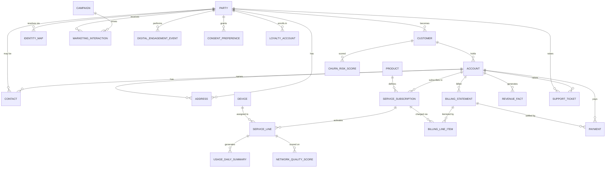

# Telecom Customer 360 — Databricks Unity Catalog Data Model

A representative enterprise-telecom Customer 360 data model, built as runnable
Unity Catalog DDL. It's the Databricks-side foundation for the Adobe RTCDP
Federated Audience Composition (FAC) demo: these are the tables FAC would
connect to live (via Delta Sharing) to build an email audience without any
data leaving the lakehouse.

24 tables across 6 domain schemas under one catalog (`telecom_c360`):

| Schema       | Tables | Purpose |
|--------------|--------|---------|
| `party`      | 6  | Identity spine — party, customer, account, contact, address, and the CDP identity-resolution bridge. |
| `product`    | 4  | Catalog, subscriptions, devices, and individual telecom lines (MSISDN/SIM). |
| `network`    | 3  | Usage facts and network-quality/outage data. |
| `billing`    | 4  | Statements, line items, payments, and a monthly revenue/ARPU fact. |
| `engagement` | 6  | Campaigns, marketing interactions, digital engagement, consent, care, loyalty. |
| `analytics`  | 1  | ML-derived churn/upsell/CLV scores. |

## Run order

Run the files in `sql/` in numeric order (`00` → `07`). Foreign keys are
split into their own file (`07`) run last, so table creation in `01`–`06`
never has to worry about forward references. Rename the `telecom_c360`
catalog in `00_catalog_and_schemas.sql` to match your actual naming
convention before running against a real workspace.

```
sql/00_catalog_and_schemas.sql   Catalog + 6 domain schemas
sql/01_party_identity.sql        party, customer, account, contact, address, identity_map
sql/02_product_service.sql       product, service_subscription, device, service_line
sql/03_network_usage.sql         usage_daily_summary, network_event, network_quality_score
sql/04_billing_revenue.sql       billing_statement, billing_line_item, payment, revenue_fact
sql/05_engagement_marketing.sql  campaign, marketing_interaction, digital_engagement_event,
                                  consent_preference, support_ticket, loyalty_account
sql/06_analytics.sql             churn_risk_score
sql/07_foreign_keys.sql          all FK constraints (informational, Unity Catalog)
```

## Entity relationship diagram



## Identity & consent — the two tables FAC actually cares about

Every other table in this model exists to feed a composition; `identity_map`
and `consent_preference` are the two that make the composition **usable**:

- **`party.identity_map`** normalizes every external identifier (hashed
  email, MSISDN, loyalty ID, Adobe ECID, CRM account ID, cookie ID) against
  one internal `party_id`. An FAC composition joins on whichever namespace
  the activation channel needs — for email, `EMAIL_SHA256`. Store hashed
  values only; never raw PII in the value column.
- **`engagement.consent_preference`** is the gate. Every composition that
  activates to a marketing channel should join through this table and filter
  to an active `OPT_IN`, per the requested channel and regulation (TCPA,
  CAN-SPAM, GDPR, CCPA as applicable). This is also the strongest governance
  talking point for the client walkthrough: consent is enforced *in the
  join*, not bolted on after.

## Example composition query

What an FAC composition (or a Databricks SQL warehouse query backing one)
looks like for a retention-email audience — high churn risk, high value,
opted in, not already contacted this week:

```sql
SELECT
  im.identity_value AS email_sha256,
  c.customer_id,
  crs.churn_probability,
  rf.arpu
FROM analytics.churn_risk_score crs
JOIN party.customer          c   ON c.customer_id = crs.customer_id
JOIN party.identity_map      im  ON im.party_id = c.party_id
                                 AND im.identity_namespace = 'EMAIL_SHA256'
                                 AND im.identity_status = 'ACTIVE'
JOIN engagement.consent_preference cp ON cp.party_id = c.party_id
                                 AND cp.channel = 'EMAIL'
                                 AND cp.consent_status = 'OPT_IN'
JOIN billing.revenue_fact    rf  ON rf.account_id = (
                                       SELECT a.account_id FROM party.account a
                                       WHERE a.customer_id = c.customer_id
                                       ORDER BY a.opened_date DESC LIMIT 1
                                     )
                                 AND rf.revenue_month = date_trunc('MONTH', current_date())
LEFT ANTI JOIN engagement.marketing_interaction mi
       ON mi.party_id = c.party_id
      AND mi.interaction_ts >= current_date() - INTERVAL 7 DAYS
WHERE crs.churn_probability >= 0.7
  AND rf.arpu >= 60
  AND crs.score_date = current_date();
```

This is the shape of logic an FAC composition canvas expresses visually —
included here as the concrete artifact to walk the client through before
opening the canvas live.

## Notes on scale/realism choices

- IDs are `STRING` UUIDs throughout, matching how most Databricks
  ingestion pipelines land natural/surrogate keys from upstream CRM/OSS/BSS
  systems.
- `usage_daily_summary` and `revenue_fact` are partitioned (`usage_date`,
  `revenue_month`) — the two tables with genuine high-cardinality volume in
  a real telecom deployment.
- Foreign keys are declared but, consistent with Unity Catalog, are
  informational rather than enforced — they exist for the query optimizer,
  BI tools, and catalog lineage, not as write-time constraints.
- This model intentionally stops short of raw CDR (call detail record)
  ingestion — `usage_daily_summary` is the pre-aggregated grain a marketing
  audience actually filters on; raw CDR volume belongs in a separate
  bronze-layer pipeline, not federated live into a CDP composition.
